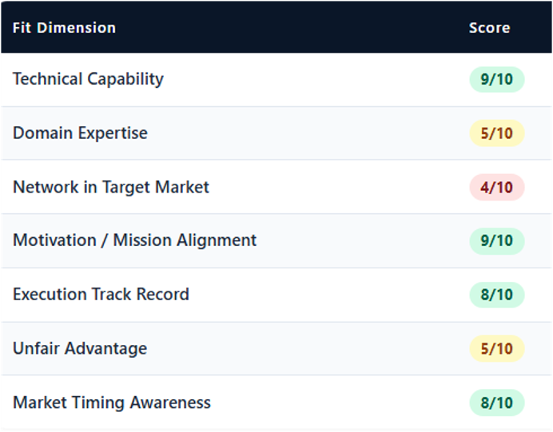

# Day 22: Validate Your Startup Idea Like a VC

## Objective
Startup success depends on solving real problems for real customers. Claude can help founders validate ideas, identify risks, understand customers, analyze competitors, and prioritize actions before building products.

1. **Problem Validation**: Determine whether the problem is painful enough to solve.
2. **Market Research**: Analyze opportunity size and market demand.
3. **Founder-Market Fit**: Assess how well your background aligns with the opportunity.
4. **Execution Planning**: Create actionable next steps for startup validation.

## Prompt
>
    Act as a Startup Advisor, VC Analyst, and Market Research Expert.
    
    Help me validate my startup idea.
    
    First ask me:
    
    1. Startup Idea
    2. Problem Being Solved
    3. Target Customers
    4. Why I Want to Build It
    5. Existing Validation (users, feedback, waitlist, etc.)
    6. Target Market/Country
    7. Startup, Business, or Side Project?
    
    After collecting my answers, generate a professional PDF-ready Startup Validation Report containing:
    
    * Executive Summary
    * Problem Validation
    * Founder-Market Fit Score
    * TAM, SAM, SOM Analysis
    * Competitor Analysis
    * Market Gap Analysis
    * Ideal Customer Profile (ICP)
    * Buyer Persona
    * Customer Pain Points
    * Buying Triggers & Objections
    * Customer Journey
    * Risk Assessment
    * Pivot Opportunities
    * Go / No-Go Recommendation
    * 30-Day Action Plan
    
    Use tables, scores, charts, and professional consulting-style formatting.
    
    Output should look like a report prepared by McKinsey, Y Combinator, or a VC firm and be ready for direct PDF export.
>

## Key Learning
I spent the afternoon asking AI to 𝘵𝘦𝘢𝘳 𝘰𝘯𝘦 𝘰𝘧 𝘮𝘺 𝘪𝘥𝘦𝘢𝘴 𝘢𝘱𝘢𝘳𝘵.

It didn't just answer my questions. It handed me a 16-section report with market sizing, competitor blind spots, customer personas, a risk matrix, and a Go/No-Go score. Now it has my attention!! 🤔

Here's what actually surprised me:

𝗧𝗵𝗲 𝗽𝗿𝗼𝗯𝗹𝗲𝗺 𝘄𝗮𝘀𝗻'𝘁 𝘁𝗵𝗲 𝗶𝗱𝗲𝗮. 𝗜𝘁 𝘄𝗮𝘀 𝘁𝗵𝗲 𝗮𝗯𝘀𝗲𝗻𝗰𝗲 𝗼𝗳 𝗲𝘃𝗶𝗱𝗲𝗻𝗰𝗲.

No waitlist. No user interviews. No signal that real people wanted what I was imagining. The AI didn't sugarcoat it, it called this out as the #1 risk, scored it 1/10, and labelled it a hard No-Go on that dimension alone.🤯 

That's the point.

Most founders spend 3 – 6 months building before they discover this. I found out in a single session. At least, I have a direction that needs attention and some brainstorming.

𝗪𝗵𝗮𝘁 𝗰𝗵𝗮𝗻𝗴𝗲𝗱 𝗮𝗳𝘁𝗲𝗿 𝘁𝗵𝗲 𝘃𝗮𝗹𝗶𝗱𝗮𝘁𝗶𝗼𝗻 𝗲𝘅𝗲𝗿𝗰𝗶𝘀𝗲:
 • I now know exactly which 2 differentiators I need to lead with.
 • I have a 30-day action plan before I write a single line of code.
 • I have a clear kill criterion; if X doesn't happen by Day 90, I pivot.
 • I understand which customer segment to win first, and why.
 • I know my Founder-Market Fit score (and where I'm weak).

This isn't about replacing your judgment with AI.

It's about using AI as the most ruthless first investor you'll ever pitch, one that doesn't take equity, has no ego, and asks every uncomfortable question at 10x the speed of any mentor.

𝗧𝗵𝗲 𝗳𝗿𝗮𝗺𝗲𝘄𝗼𝗿𝗸 𝗶𝘀 𝘀𝗶𝗺𝗽𝗹𝗲:
✦ Problem Validation
✦ Market Sizing (TAM → SAM → SOM)
✦ Competitor & Gap Analysis
✦ ICP + Buyer Persona
✦ Risk Assessment & Pivot Paths
✦ Weighted Go / No-Go Decision

✨ 𝘐𝘧 𝘺𝘰𝘶 𝘩𝘢𝘷𝘦 𝘢𝘯 𝘪𝘥𝘦𝘢 𝘴𝘪𝘵𝘵𝘪𝘯𝘨 𝘪𝘯 𝘺𝘰𝘶𝘳 𝘯𝘰𝘵𝘦𝘴 𝘢𝘱𝘱, 𝘳𝘶𝘯 𝘪𝘵 𝘵𝘩𝘳𝘰𝘶𝘨𝘩 𝘵𝘩𝘪𝘴 𝘣𝘦𝘧𝘰𝘳𝘦 𝘥𝘰𝘪𝘯𝘨 𝘢𝘯𝘺𝘵𝘩𝘪𝘯𝘨 𝘦𝘭𝘴𝘦.✨

"𝗩𝗮𝗹𝗶𝗱𝗮𝘁𝗲 𝗯𝗲𝗳𝗼𝗿𝗲 𝘆𝗼𝘂 𝗯𝘂𝗶𝗹𝗱" used to be the advice.
Now it's table stakes.

And with AI, there's no excuse not to.

## *Startup Verdict Concept*

## *My Idea Verdict & Score*
 
