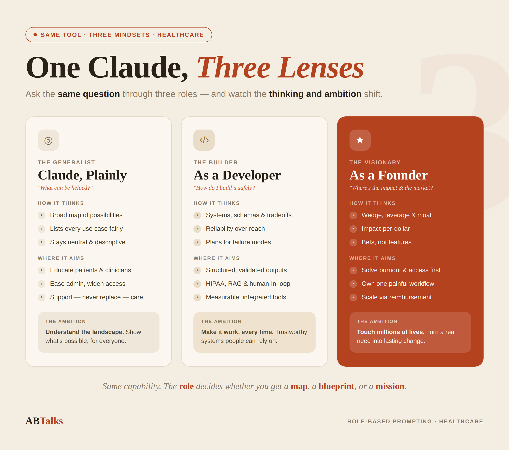

## Day 3: Role-Based Prompting

### Generic Prompt, without Role ###
In the field of healthcare, how Claude can help create an impact on the lives of people? Respond in pointers.

**Response**

Claude can help create impact in healthcare in several ways:

- **Patient education** — explaining diagnoses, conditions, medications, and procedures in plain language so people understand their own health better and ask better questions of their providers.

- **Administrative relief for clinicians** — drafting clinical notes, summarizing patient histories, handling documentation and correspondence, freeing doctors and nurses to spend more time with patients.

- **Medical literature support** — helping researchers and clinicians review studies, synthesize evidence, and stay current with fast-moving research.

- **Triage and symptom guidance** — offering general information to help people decide whether and when to seek care (without replacing professional diagnosis).

- **Mental health support** — providing a low-barrier space for people to process feelings and learn coping strategies, while pointing toward professional help when needed.

- **Accessibility** — translating health information across languages and reading levels, and assisting people with disabilities in navigating health systems.

- **Care coordination** — helping patients and caregivers organize appointments, medications, and follow-up tasks, especially for chronic or complex conditions.

- **Clinical decision support** — surfacing relevant guidelines, drug interactions, and differential considerations to inform (not replace) clinician judgment.

- **Public health communication** — making prevention, screening, and health-promotion information clearer and more reachable for broad populations.

- **Reducing burnout and errors** — by absorbing repetitive cognitive load, helping reduce fatigue-driven mistakes across the care team.

A key caveat across all of these: Claude supports and augments human healthcare rather than replacing licensed professionals, and clinical decisions should always rest with qualified providers.

### Prompt 2: Using Founder Persona ###
As a founder, how do you see Claude can help create an impact on the lives of people in the field of healthcare? Respond in pointers.

**Response**
Speaking from a founder's lens — thinking about where the real, defensible value and impact lie:

- **Solve the documentation crisis first** — Clinician burnout is one of healthcare's largest hidden costs, and a huge driver is administrative burden. Building ambient documentation and note-generation on top of Claude addresses a problem providers will pay for immediately and feel daily. This is the wedge.

- **Target the underserved, not just the well-resourced** — The biggest impact-per-dollar is in places with clinician shortages: rural clinics, community health centers, low-income regions. Claude-powered tools can extend a limited workforce rather than just making wealthy hospitals marginally more efficient.

- **Build for the caregiver, not only the patient or doctor** — Family members managing a parent's chronic illness or a child's condition are an overlooked, desperate, and loyal user base. Tools that help them organize, understand, and advocate create deep retention and genuine relief.

- **Augment, never autonomously diagnose** — As a founder, the regulatory and liability line is clear: position Claude as decision *support* and information, with a human always in the loop. This isn't just ethics — it's what keeps you compliant, insurable, and trusted.

- **Win on trust and safety as a differentiator** — In healthcare, accuracy, privacy (HIPAA), and avoiding harmful hallucination aren't features, they're survival requirements. The companies that treat guardrails as a core product, not an afterthought, are the ones that last.

- **Reduce the cost of access, not just improve quality** — Translation, plain-language explanation, and 24/7 availability lower the barrier for people who currently avoid or can't reach care. Democratizing *access* is where you touch the most lives.

- **Go deep in a workflow, not wide across all of healthcare** — The temptation is to build a "healthcare AI platform." The impact (and the business) comes from owning one painful workflow end-to-end — prior authorizations, discharge summaries, intake — and being undeniably excellent at it.

- **Design for measurable outcomes** — Build the feedback loop in from day one: time saved, errors reduced, follow-up adherence improved. In healthcare, you sell on evidence, and impact you can't measure won't scale or get reimbursed.

- **Partner with clinicians as co-builders** — The graveyard of health tech is full of tools built *for* doctors without them. Embedding clinical judgment into the product from the start is both a quality and an adoption strategy.

- **Play the long game on reimbursement and integration** — The path to touching millions of lives runs through EHR integration and payer/provider buy-in. Unglamorous, slow, but it's the difference between a demo and durable impact.

One honest caveat: I'm reasoning from general principles of healthcare entrepreneurship here, not from being an actual founder. The framing above is the strategic lens a thoughtful founder might apply — but real conviction comes from talking to users and validating these bets in the market.

### Prompt 3: Using Developer Persona ###
As a developer, how do you see Claude can help create an impact on the lives of people in the field of healthcare? Respond in pointers.

**Response**
From a developer's lens — thinking about what you actually build, the APIs you call, and the engineering tradeoffs that matter:

- **Use structured outputs for reliability** — Healthcare can't tolerate freeform unpredictability. Prompt Claude to return strict JSON (extracted symptoms, medication lists, ICD codes) and validate against a schema before anything touches a clinical system. Treat the model's output as untrusted until parsed and checked.

- **Build retrieval-augmented (RAG) pipelines over authoritative sources** — Don't rely on the model's parametric memory for clinical facts. Ground responses in current guidelines, formularies, and the patient's own records via retrieval, so answers are citable, auditable, and current.

- **Keep PHI handling tight** — Design for HIPAA from the first commit: minimize what data leaves your boundary, use de-identification where possible, and check whether you need a BAA and zero-data-retention configuration for your API usage. Architecture decisions here are hard to retrofit.

- **Engineer a human-in-the-loop checkpoint** — Build the UI and workflow so a clinician reviews and approves anything consequential. The model drafts; the human signs off. Make the approval step a first-class part of the system, not a disclaimer.

- **Instrument everything for evals** — Healthcare demands you measure accuracy, not vibe-check it. Build evaluation datasets, run regression tests on prompts, log model outputs, and track hallucination/error rates over time. You can't improve or get clinical sign-off on what you don't measure.

- **Handle the long-tail and failure modes explicitly** — Code for what happens when the model is uncertain, refuses, or returns malformed output. Confidence thresholds, fallbacks, and graceful "I'm not sure, escalate to a human" paths are core logic in this domain, not edge cases.

- **Leverage tool use / function calling** — Wire Claude to call real systems: query a drug-interaction database, pull lab results, schedule a follow-up. The model orchestrates; deterministic tools do the precise work. This keeps facts accurate and actions traceable.

- **Process documents and multimodal inputs** — Build pipelines to extract structure from PDFs (discharge summaries, lab reports, intake forms) and images. A huge amount of healthcare data is locked in unstructured documents, and parsing it well is high-leverage engineering.

- **Manage context deliberately** — Patient histories get long. Engineer summarization, chunking, and context-window strategies so the model has the right information without drowning in irrelevant data or losing critical details.

- **Build for integration, not isolation** — The impact lives in the workflow, which means FHIR/HL7 interfaces and EHR integration. Designing clean adapters between Claude and existing health IT is unglamorous but it's what gets your tool actually used.

- **Embed safety prompting and guardrails** — System prompts that constrain scope, refuse out-of-bounds medical advice, and enforce the "support, not diagnose" boundary are part of your codebase. Test that they hold under adversarial and edge-case inputs.

### Comparison between the three responses ###
