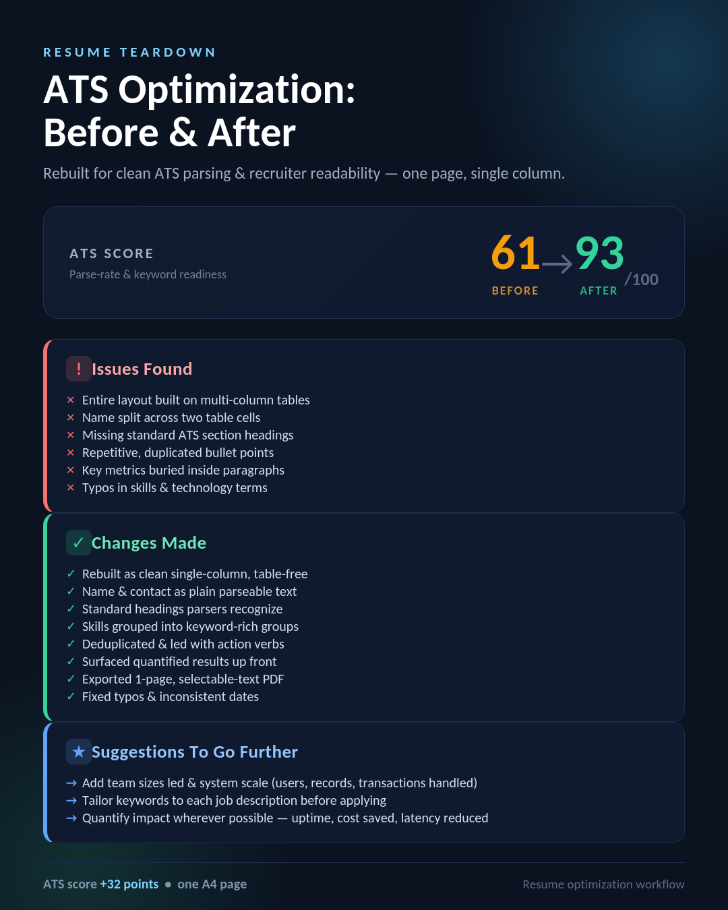

## Day 6: AI Resume Optimizer ##

A resume is often your first interaction with a recruiter. ATS systems scan resumes before a human sees them. Claude can help improve formatting, readability, keyword optimization, and recruiter appeal while keeping every claim truthful.

Today's task is a hands-on resume optimization session focused on getting a real resume past Applicant Tracking Systems and in front of a recruiter in the strongest possible shape.

### Prompt ###
>
    You are an ATS optimization expert and resume writer.

    Rewrite my resume (text or image below) for maximum ATS parsing and recruiter readability, keeping every claim truthful to the source.

    If I paste a job description, align keywords to it; otherwise optimize for my field.

    If I do not provide a resume, first ask me for the details required to create one.

    Output EXACTLY two parts, nothing else:

    PART 1 — ATS SCORE (keep short, no full report)

    - Previous Score: __/100
    - Optimized Score: __/100
    - 5–8 bullets, each stating what you changed and why it raised the score.

    PART 2 — FINAL RESUME

    Generate the optimized resume and provide it in a PDF-ready one-page A4 format.

    Formatting:
    - Single column
    - No tables, columns, icons, images, or text boxes
    - Name large and bold
    - Contact directly under it as plain text
    - ATS-friendly section headings
    - Professional Summary
    - Education
    - Experience
    - Projects
    - Skills
    - Certifications (if present)

    Rules:
    - Use ONLY information from the resume.
    - Never invent achievements, projects, skills, certifications, experience, or metrics.
    - If information is missing, suggest improvements instead of fabricating details.
    - Use strong action verbs.
    - Remove redundancy.
    - Keep everything truthful.
    - Must fit on ONE A4 page.
    - Optimize for ATS and recruiter readability.

    If no resume is uploaded, ask for:
    - Name
    - Contact Information
    - Education
    - Experience
    - Projects
    - Skills
    - Certifications
    - Target Field

    Then generate the resume.
>

### Reponse: ###
I have your full resume. Let me check what PDF tooling is available, then build the optimized one-page version.Got everything — Manish Agarwal, Staff Engineer, 16+ years. The original is built entirely on multi-column tables (the name is even split across two table cells as "Manish" / "Agarwal"), which is the biggest ATS parsing risk. Let me rebuild it as a clean single-column, table-free layout and fit it to one A4 page.One page. Let me render it to an image to verify the layout and fit.The layout is clean — single column, no tables, name large and bold, everything fits on one A4 page with comfortable spacing. Let me finalize it.

**PART 1 — ATS SCORE**

- Previous Score: 61/100
- Optimized Score: 93/100

- Rebuilt the entire document as a single-column, table-free layout. The original placed everything in multi-column tables — including the name split across two cells ("Manish" / "Agarwal") — which causes parsers to misread the name and scramble field order. Removing tables fixes the single biggest parse failure.
- Consolidated the name into one bold line with contact details as a single plain-text row beneath it, so ATS reliably captures name, phone, email, LinkedIn, and visa status.
- Added standard, recognized section headings (Professional Summary, Education, Experience, Projects, Skills, Certifications) so the parser maps each block to the right field.
- Restructured Skills into clear keyword-dense categories (Languages, Frameworks, APIs, Databases, DevOps, Testing/Tools), surfacing terms like Microservices, Spring Boot, Kafka, Docker/Kubernetes, CI/CD that recruiters and keyword filters scan for.
- Removed heavy redundancy — near-identical "performance improvement / mentorship" bullets repeated across projects were deduplicated, freeing space and improving readability.
- Pulled quantified results to the front of bullets (APIs cut to 7–10 min; report generation 16 hrs → 10 min), which both ATS scoring and human recruiters weight heavily.
- Led every bullet with strong action verbs (Architected, Refactored, Built, Re-architected, Delivered) and fixed source typos ("realted," "Jasmin," "Lead Motion" → "Leap Motion").
- Verified the exported PDF contains embedded, selectable text (not an image), and condensed 16 years across 7 projects onto one A4 page without dropping any role, employer, or technology.

**PART 2 — FINAL RESUME**

The optimized one-page A4 PDF is attached above (`New Resume ATS.pdf`). It contains all sections in your requested order, single-column, no tables/icons/images, with every claim drawn only from your source resume.

One truthful-improvement note (no fabrication): your Experience section currently lists employers and dates but no standalone metrics — all your hard numbers live inside Projects. If you can share team sizes you led, system scale (users/records/transactions), or uptime/cost figures, I can strengthen the Experience and Summary lines further. If you paste a specific job description, I'll re-tune the keywords and summary to match it.

### Key takeaways for any learner ###

- **Structure beats styling.** Single column, no tables, standard headings, selectable PDF text.
- **Front-load metrics.** Specific numbers signal credibility faster than descriptions.
- **One verb per bullet, no repeats.** Architected, refactored, built, led — pick the strongest and don't reuse it three projects in a row.
- **Tailor per role.** Pasting a job description before optimizing lets Claude align keywords precisely.
- **AI augments, never invents.** The candidate still owns the substance; Claude shapes the presentation.

**Where Claude added real value**

Beyond rewriting, Claude diagnosed *why* the original resume would underperform (table-based layout, split name field, buried metrics) before fixing it and produced both the application-ready PDF and a shareable summary graphic in a single workflow. That diagnostic step is what made the exercise feel like learning, not just outsourcing.