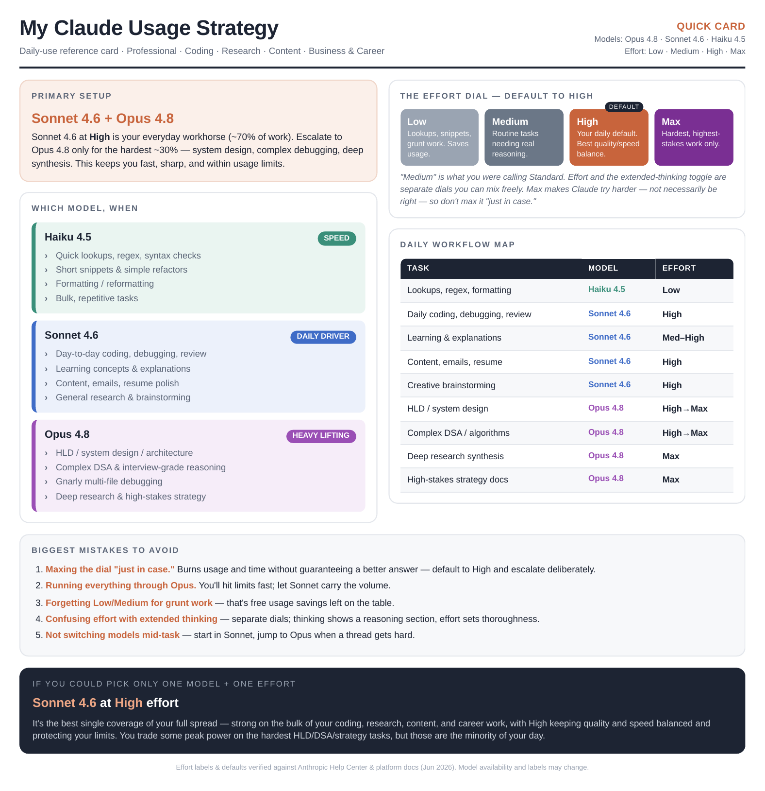

## Day 7: Claude Model Selection & Reasoning Effort

Claude offers different models optimized for different types of work. Day 7 is about understanding when to use Haiku, Sonnet, Opus, and different reasoning effort levels that help us get better outputs while improving efficiency.

1. **Haiku**: Best for speed, quick summaries, rewrites, and simple tasks.
2. **Sonnet**: Best balance of intelligence, speed, and cost. Ideal for most users.
3. **Opus**: Best for deep research, strategy, complex planning, and advanced reasoning.
4. **Reasoning Effort**: Low, Standard, High, and Max determine how much thinking Claude performs before answering.

## Respose from Claude
Perfect, that gives me a clear picture. Before I lock in recommendations, let me verify the current model lineup and effort settings against Anthropic's docs so I'm not giving you stale info. Verified against Anthropic's current docs — quick correction before the strategy: the consumer Claude.ai effort dial is actually **Low / Medium / High / Max** (not "Standard"), where High is the default and gives the best balance of quality and speed, while Max is the most thorough option for difficult or longer-running tasks. Low and Medium work well for routine tasks and stretch your usage further. Some interfaces also surface an "Extra" level (which maps to what Claude Code calls *xhigh*). I'll map your four-tier framework onto the real labels below.

Here's your full strategy, built around your profile: a daily-using Professional doing coding, research, content, and business/career work.

### My Claude Usage Strategy

### Recommended Primary Model
**Sonnet 4.6 as your everyday workhorse + Opus 4.8 for the heavy lifting.**

You're not a single-model user — your work spans quick technical tasks to genuinely hard reasoning. The smart pattern is a two-model rhythm rather than forcing everything through one model.

### Why This Model Fits Me
You use Claude daily across four demanding categories. Running *everything* through Opus would burn through usage limits fast and add latency to tasks that don't need it. Running everything through Haiku would underpower your architecture and strategy work. Sonnet 4.6 hits the sweet spot for the bulk of daily volume (coding, drafting, research, learning), and you escalate to Opus 4.8 only when the problem is genuinely hard - system design, complex debugging, deep synthesis. This keeps you fast and within limits *and* sharp where it counts.

### When to Use Haiku (4.5)
Reach for Haiku when **speed and volume** matter more than depth:
- Quick fact lookups, regex, syntax checks
- Short code snippets, simple refactors
- Formatting, reformatting, quick rewrites
- Bulk/repetitive tasks where a marginally better answer isn't worth the wait

### When to Use Sonnet (4.6)
Your **default for ~70% of daily work**:
- Day-to-day coding, debugging, code review
- Learning new concepts and explanations
- Drafting and editing content, emails, docs
- Resume/career-prep polish and creative brainstorming
- General research that doesn't require deep multi-source synthesis

### When to Use Opus (4.8)
Reserve for your **hardest ~30%** — the work that's closest to your Principal Engineer goals:
- High-Level Design (HLD) and system architecture
- Complex DSA walkthroughs and interview-grade reasoning
- Gnarly multi-file debugging or refactors
- Deep research synthesis across many sources
- High-stakes strategy and business-planning documents

### Recommended Effort Level
Your **default should stay on High** - it's already the model default and the best quality/speed balance. Effort and the extended-thinking toggle are separate settings you can mix freely.

- ### Low
    Quick lookups, classification, simple snippets, high-volume grunt work. Saves usage and latency.

- ### Medium *(this is what you were calling "Standard")*
    Routine tasks that need real reasoning but not maximum depth - straightforward coding, summaries, everyday explanations.

- ### High *(your daily default)*
    Complex coding, nuanced analysis, content that needs to be good, most of your real work.

- ### Max
    The hardest, highest-stakes tasks: tough system design, deep research, complex algorithms, important strategy docs. One honest caveat - Max makes Claude try harder, not necessarily be right; on something it would get wrong at High, it can still get wrong at Max, just slower and more expensively. So don't reflexively max the dial "just in case."

### My Personalized Claude Workflow

| Task | Best Model | Best Effort | Reason |
|------|-----------|-------------|--------|
| Quick lookups, regex, syntax, formatting | Haiku 4.5 | Low | Speed + save usage; depth not needed |
| Daily coding, debugging, code review | Sonnet 4.6 | High | Best balance for high-volume technical work |
| Learning concepts, explanations | Sonnet 4.6 | Medium–High | Solid teaching without burning limits |
| Content drafting, emails, resume polish | Sonnet 4.6 | High | Quality writing at reasonable cost |
| Creative brainstorming | Sonnet 4.6 | High | Strong ideation, generous limits |
| HLD / system design / architecture | Opus 4.8 | High → Max | Interview-grade depth; closest to your goals |
| Complex DSA / algorithm reasoning | Opus 4.8 | High → Max | Hardest reasoning benefits from full capability |
| Deep research synthesis | Opus 4.8 | Max | Thoroughness across many sources |
| High-stakes strategy / business docs | Opus 4.8 | Max | Long, consequential work justifies the cost |

### Biggest Mistakes I Should Avoid
1. **Maxing the dial "just in case."** It burns usage and time without guaranteeing a better answer. Default to High; escalate deliberately.
2. **Running everything through Opus.** You'll hit limits fast and slow down trivial tasks. Let Sonnet carry the volume.
3. **Forgetting to drop to Low/Medium** for grunt work, that's free usage savings you're leaving on the table.
4. **Conflating effort with extended thinking.** They're separate dials; turning on thinking gives you a visible reasoning section, while effort controls overall thoroughness.
5. **Not switching models mid-task.** You can change models within one conversation, start in Sonnet, escalate to Opus when a thread gets hard.

### Final Recommendation
**If you could use only ONE model and ONE effort level: Sonnet 4.6 at High effort.**

Here's why: it's the single best coverage of *your* spread. It handles the vast majority of your daily coding, research, content, and career work at genuinely strong quality, while High keeps the quality/speed balance optimal and protects your usage limits in a way Opus-everywhere wouldn't. You'd give up some peak capability on the hardest HLD/DSA/strategy tasks, but those are the *minority* of your day, and for everything else Sonnet at High is the most sustainable, productive default a daily power user can run.

The two-model rhythm above is better still, but if you want one dial set and forget, that's it.

## My Key Learnings

- **No single model is "best", match the model to the task.** Haiku for speed, Sonnet for daily volume, Opus for hard reasoning.

- **Sonnet 4.6 is my default workhorse.** It covers ~70% of my work well, so I shouldn't reach for Opus by reflex.

- **Opus 4.8 is a tool, not a habit.** I save it for the genuinely hard 30% — system design, complex debugging, deep research, high-stakes strategy.

- **Effort and model are two separate dials.** I pick *what* thinks (model) and *how hard* it thinks (effort) independently.

- **High effort is my home base.** Best balance of quality and speed; I only move off it on purpose.

- **"Max" ≠ "more correct."** It tries harder, not necessarily smarter, so I won't max things "just in case."

- **Dropping to Low/Medium is a skill, not laziness.** It saves my usage limits for when they matter.

- **I can switch models mid-conversation.** Start light in Sonnet, escalate to Opus only when a thread gets hard.

- **My real win is intentionality**. Choosing model + effort deliberately beats defaulting to the biggest option every time.