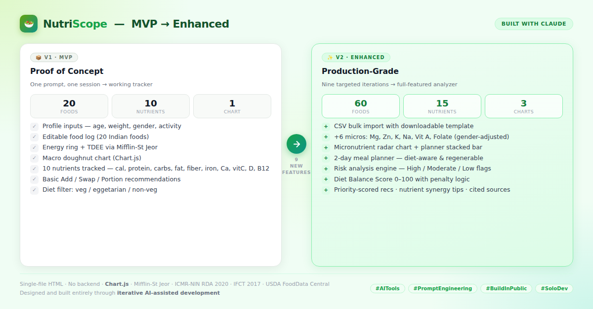

## Day 9: Build & Enhance an AI Nutrition Analytics App

### Objective
One of the biggest mistakes beginners make is asking AI to build extremely large applications in a single prompt. Professional AI builders use iterative development: first build a working MVP, then progressively enhance it. This improves reliability, quality, and output consistency.

1. MVP First: Generate a working version before adding complexity.
2. Iterative Development: Improve outputs through multiple focused prompts.
3. Claude Artifacts: Generate real interactive applications.
4. AI Product Building: Build products the same way experienced builders do.

### Prompt 1 - Build MVP
>
    Build a complete single-file HTML application called NutriScope.
    
    Requirements:
    
    Profile Inputs:
    Age, gender, Height, Weight, Activity Level, Dietary Preference (Vegetarian, Non-Vegetarian, Eggetarian).
    
    Food Logging:
    Add Food, Quantity, Unit, Editable Table, Remove Entry.
    
    Food Database:
    Include 20 common foods only:
    Rice, Roti, Dal, Paneer, Curd, Chana, Rajma, Banana, Apple, Milk, Oats, Bread, Egg, Chicken, Fish, Potato, Poha, Idli, Dosa, Spinach.
    
    Track:
    Calories, Protein, Carbs, Fat, Fiber, Iron, Calcium, Vitamin C, Vitamin D, Vitamin B12.
    
    Calculations:
    Energy, Macro Targets, Micronutrient Targets, Percentage Completion.
    
    Dashboard:
    Energy Progress, Macro Chart, Top Deficiencies, Top Excesses, Nutrient Table.
    
    Recommendations:
    Food additions, food swaps, portion adjustments based on dietary preference.
    
    Design:
    Premium SaaS UI, Mobile Responsive, Chart.js, Dark Theme, Modern Cards, No Backend, Single HTML File.
    
    Return only the complete HTML code.
>

### Response
I'll build NutriScope as a complete single-file app. Let me create it.JS validates clean. Here's the finished app.**NutriScope** is complete — a single self-contained HTML file, no backend, ready to open in any browser.

What's inside:

- **Profile** — age, gender, height, weight, activity, dietary preference. Targets recompute live (BMR via Mifflin-St Jeor → TDEE; protein at 1.6 g/kg, fat at 25%, carbs as remainder, fiber at 14 g/1000 kcal; iron/calcium/vit C/D/B12 by RDA with gender adjustment).

- **Food log** — all 20 foods with per-100g data across every tracked nutrient, multiple realistic units (piece/bowl/cup/slice/glass), editable quantities inline, and per-row removal.

- **Dashboard** — energy progress ring, Chart.js macro doughnut (by calorie share), top deficiencies, top excesses, and a full nutrient table with completion bars colored by status.

- **Recommendations** — split into Add / Swap / Portion, filtered strictly by dietary preference (vegetarian sees only veg foods, eggetarian adds egg, non-veg unlocks chicken/fish), with gap-coverage estimates.

It loads pre-populated with a sample breakfast + lunch so the dashboard is alive on first open; clear the rows to start fresh. Two notes on the choices I made: protein defaults to 1.6 g/kg (active-leaning rather than the 0.8 g/kg minimum RDA), and fish values assume an oily fish for the vitamin D figure — easy to tune in the `FOODS` object if you'd prefer different baselines.

[NutriScope v1](nutriscope%20v1.html)

### Time to enhance it. Prompt 2.
>
    Enhance the existing NutriScope application.
    
    Add:
    CSV Upload, 40 more foods, Additional micronutrients, 2-day meal planner, Risk Analysis, Educational Disclaimer, Nutrition Sources, Better Charts, Advanced Recommendations.
    
    Return the updated HTML only.
>

### Response
Good build to start from. This is a major expansion — let me rebuild NutriScope with all nine additions. I'll replace the existing file.

NutriScope v2 is ready. What changed:

1. **CSV upload**: import a day's log via CSV (food, quantity, unit), with a downloadable template and added/skipped feedback.

2. **40 more foods (60 total)**: grains, legumes, dairy, meats, nuts/fats, fruits, and vegetables, each tagged veg/egg/nonveg.

3. **More micronutrients (15 tracked)**: added magnesium, zinc, potassium, sodium (as a limit), vitamin A, and folate.

4. **2-day meal planner**: generates diet-filtered breakfast/lunch/dinner/snack plans with per-meal kcal/protein and a stacked bar chart against your target.

5. **Risk analysis**: flags low protein/fibre/iron/calcium/D/B12/C/zinc and high sodium/fat plus surplus/deficit, sorted by severity.

6. **Educational disclaimer**: banner clarifying it's informational, not medical advice.

7. **Nutrition sources**: methodology card citing Mifflin-St Jeor, ICMR-NIN RDA 2020, NIH/IOM DRIs, IFCT 2017, and USDA FoodData Central.

8. **Better charts**: kept the macro doughnut, added a micronutrient radar (% of target) and the planner bar chart.

9. **Advanced recommendations**: priority-scored Add/Swap/Portion suggestions plus a Synergy group (e.g. iron + vitamin C, calcium + D) and an overall Diet Balance Score (0–100).

Everything stays in one self-contained HTML file. The values are modeled approximations for guidance, not clinical figures.

[NutriScope v2](nutriscope%20v2.html)

## Comparison between v1 and v2

## Key Learnings
1. One-shot prompts give you an MVP. Iterative prompting gives you a product.

2. Specificity is everything — "add risk analysis with High/Moderate/Low severity" beats "make it smarter".

3. AI handles data-dense work surprisingly well. 60 foods × 15 nutrients × per-100g values — done in one pass.

4. Validation is still your job. I ran node --check on every JS build before shipping.

5. The real skill shift: thinking in features and outcomes, not in code.